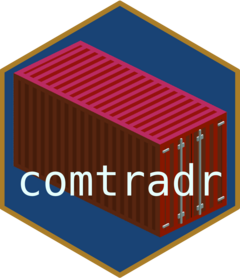

---
output:
  github_document: default
  html_document: default
---

<!-- README.md is generated from README.Rmd. Please edit that file -->

```{r, echo = FALSE}
knitr::opts_chunk$set(collapse = TRUE, comment = "#>")
```

comtradr 
=======
<!-- badges: start -->
[](https://cran.r-project.org/package=comtradr)
[](https://github.com/ropensci/software-review/issues/141)
[](https://github.com/ropensci/comtradr/actions/workflows/R-CMD-check.yaml)
[](https://app.codecov.io/gh/ropensci/comtradr?branch=api-update)
<!-- badges: end -->

R package for interacting with the [UN Comtrade Database](https://comtradeplus.un.org/) public API. UN Comtrade provides historical data on the weights and value of specific goods shipped between countries, more info can be found [here](https://unstats.un.org/wiki/display/comtrade). Full API documentation can be found
[here](https://comtradedeveloper.un.org/).


## Currently re-launching Comtradr 🚧

The Comtrade API has been undergoing extensive updates. At this point the legacy API has been taken offline (see [here](https://unstats.un.org/wiki/display/comtrade/New+Comtrade+FAQ+for+Advanced+Users#NewComtradeFAQforAdvancedUsers-WhatisthelegacyoftheUNComtrade?UntilwhencanIuseit?)).

In order to accomodate the new syntax, as well as adding the new functionality, the `comtradr` package has been undergoing an extensive re-write. Additionally, it is not possible anymore to query the API without an API token. There still is a free version, but unlike before you need to be a registered user to obtain the token. See the [FAQ](https://unstats.un.org/wiki/display/comtrade/New+Comtrade+User+Guide#NewComtradeUserGuide-UNComtradeAPIManagement) for details on how to obtain the new access tokens. 

Please [report](https://github.com/ropensci/comtradr/issues) issues, comments, or feature requests. We are very much looking for feedback on the useability of the new functions. 

The package in its old version is still available from the `legacy-0-3-0` branch.

Please note that this package is released with a [Contributor Code of Conduct](https://ropensci.org/code-of-conduct/). By contributing to this project, you agree to abide by its terms.

For information on citation of this package, use `citation("comtradr")`

## Installation 🛠️

Currently, the package is not on CRAN, but we plan on publishing to CRAN in the near future. Install the current development version from this repo:

```{r eval=FALSE}
# install.packages("devtools")
devtools::install_github("ropensci/comtradr@main")
```

## Usage

### Authentication 🔐

If you are in an interactive session, you can call the following function to save your API token to the environment file for the current session. 

```{r, eval = F}
library(comtradr)

set_primary_comtrade_key()
```

If you are not in an interactive session, you can register the token once in your session using the following base-r function.

```{r, eval = F}
Sys.setenv('COMTRADE_PRIMARY' = 'xxxxxxxxxxxxxxxxx')
```

If you would like to set the comtrade key permanently, we recommend editing the project `.Renviron` file, where you need to add a line with `COMTRADE_PRIMARY = xxxx-your-key-xxxx`. 
ℹ️ Do not forget the line break after the last entry. This is the easiest by taking advantage of the great `usethis` package. 

```{r, eval = F}
usethis::edit_r_environ(scope = 'project')
``` 

### Example 1 ⛴️

Now we can get to actually request some data. Let us query the total trade between China and Germany and Argentina, as reported by China. 


```{r, eval = F}

# Country names passed to the API query function must be spelled in ISO3 format. 
# For details see: https://en.wikipedia.org/wiki/ISO_3166-1_alpha-3 

# You can request a maximum interval of twelve years from the API
example1 <- comtradr::ct_get_data(
  reporter = 'CHN',
  partner = c('ARG', 'DEU'),
  start_date = 2010,
  end_date = 2012
)

# Inspect the return data
str(example1)
```


### Example 2 ⛴️
Return all exports related to Wine from Argentina to all other countries, for years 2007 through 2011.

```{r, eval = F}
library(comtradr)

# Fetch all shrimp related commodity codes from the Comtrade commodities DB.
# This vector of codes will get passed to the API query.
wine_codes <- ct_commodity_lookup("wine", return_code = TRUE, return_char = TRUE)

# API query.
example2 <- ct_get_data(
  reporter =  "ARG",
  flow_direction = "export",
  partner = "all",
  start_date = 2007,
  end_date = 2011,
  commodity_code = wine_codes
)

# Inspect the output
str(example2)
```

[](https://ropensci.org)
