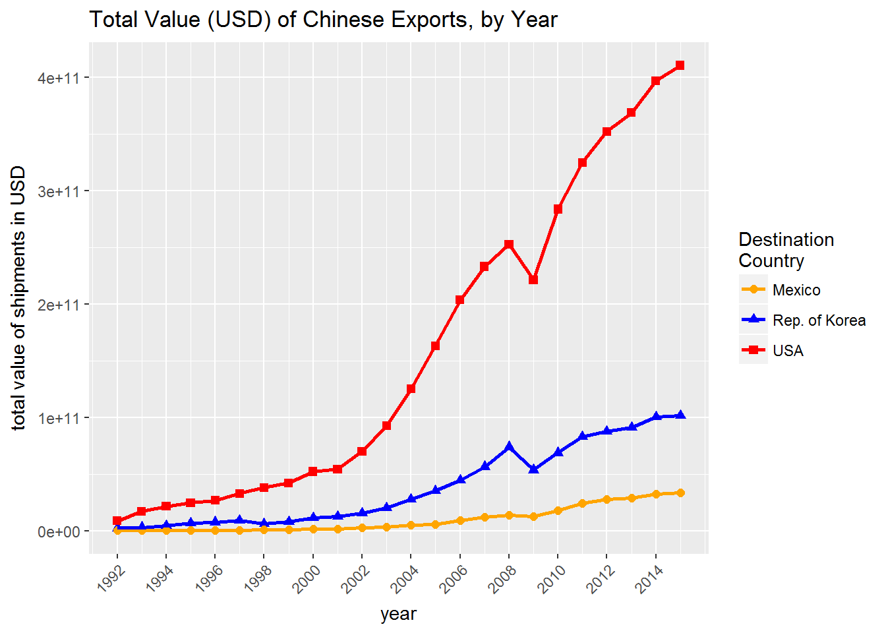
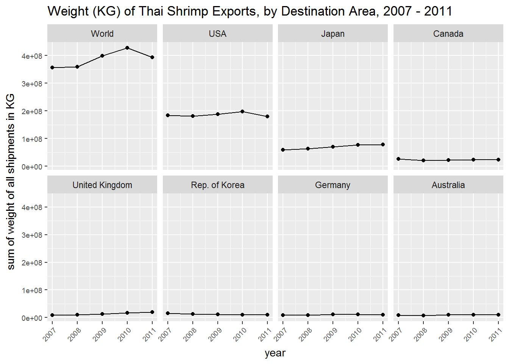

<!-- README.md is generated from README.Rmd. Please edit that file -->
comtradr
========

[](https://travis-ci.org/ChrisMuir/comtradr) [](https://ci.appveyor.com/project/ChrisMuir/comtradr) [](http://cran.r-project.org/package=comtradr)

R package for interacting with the [UN Comtrade Database](https://comtrade.un.org/data/) public API. UN Comtrade provides historical data on the weights and value of specific goods shipped between countries, more info can be found [here](https://comtrade.un.org/). Full API documentation can be found [here](https://comtrade.un.org/data/doc/api/).

This package was inspired by the [R tutorial](https://comtrade.un.org/data/Doc/api/ex/r) posted by Comtrade, and is built using [httr](https://CRAN.R-project.org/package=httr) and [jsonlite](https://CRAN.R-project.org/package=jsonlite).

I've also built a Shiny app for visualizing comtrade shipping data, that's powered by this package. The app can be viewed [here](https://chrismuir.shinyapps.io/comtrade_plot_shinyapp/).

Please [report](https://github.com/ChrisMuir/comtradr/issues) issues, comments, or feature requests.

Please note that this project is released with a [Contributor Code of Conduct](CONDUCT.md). By participating in this project you agree to abide by its terms.

**NOTE**: As of 2017-06-27, the curl errors due to an inadility to validate the SSL certificate of the API site are no longer appearing, I believe that UN Comtrade fixed their SSL cert issue. As of 2017-07-03, the package is back on CRAN.

Installation
------------

Install from CRAN:

``` r
install.packages("comtradr")
```

Or install from this repo:

``` r
# install.packages("devtools")
devtools::install_github("ChrisMuir/comtradr")
```

Example Usage
-------------

**Example 1**: Return all exports from China to South Korea, United States and Mexico, for all years

``` r
library(comtradr)

# First, read in the country code lookup table as a dataframe from Comtrade. 
# This will be used as a parameter in the API calls.
countrydf <- ct_countries_table()

# This object can also be used to look up the exact spellings of countries 
# prior to making API calls.
country_lookup("korea", "reporter", countrydf)
#> [1] "Dem. People's Rep. of Korea" "Rep. of Korea"

# Since we want South Korea, we'll use "Rep. of Korea" within the API query.
example1 <- ct_search(reporters = "China", 
                      partners = c("Rep. of Korea", "USA", "Mexico"), 
                      countrytable = countrydf, 
                      tradedirection = "exports")

# Inspect the return data
str(example1$data)
#> 'data.frame':    75 obs. of  35 variables:
#>  $ Classification        : chr  "H4" "H4" "H4" "H4" ...
#>  $ Year                  : int  2012 2012 2012 2013 2013 2013 2014 2014 2014 2015 ...
#>  $ Period                : int  2012 2012 2012 2013 2013 2013 2014 2014 2014 2015 ...
#>  $ Period Desc.          : chr  "2012" "2012" "2012" "2013" ...
#>  $ Aggregate Level       : int  0 0 0 0 0 0 0 0 0 0 ...
#>  $ Is Leaf Code          : int  0 0 0 0 0 0 0 0 0 0 ...
#>  $ Trade Flow Code       : int  2 2 2 2 2 2 2 2 2 2 ...
#>  $ Trade Flow            : chr  "Export" "Export" "Export" "Export" ...
#>  $ Reporter Code         : int  156 156 156 156 156 156 156 156 156 156 ...
#>  $ Reporter              : chr  "China" "China" "China" "China" ...
#>  $ Reporter ISO          : chr  "CHN" "CHN" "CHN" "CHN" ...
#>  $ Partner Code          : int  410 484 842 410 484 842 410 484 842 410 ...
#>  $ Partner               : chr  "Rep. of Korea" "Mexico" "USA" "Rep. of Korea" ...
#>  $ Partner ISO           : chr  "KOR" "MEX" "USA" "KOR" ...
#>  $ 2nd Partner Code      : logi  NA NA NA NA NA NA ...
#>  $ 2nd Partner           : chr  "" "" "" "" ...
#>  $ 2nd Partner ISO       : chr  "" "" "" "" ...
#>  $ Customs Proc. Code    : chr  "" "" "" "" ...
#>  $ Customs               : chr  "" "" "" "" ...
#>  $ Mode of Transport Code: chr  "" "" "" "" ...
#>  $ Mode of Transport     : chr  "" "" "" "" ...
#>  $ Commodity Code        : chr  "TOTAL" "TOTAL" "TOTAL" "TOTAL" ...
#>  $ Commodity             : chr  "All Commodities" "All Commodities" "All Commodities" "All Commodities" ...
#>  $ Qty Unit Code         : int  1 1 1 1 1 1 1 1 1 1 ...
#>  $ Qty Unit              : chr  "No Quantity" "No Quantity" "No Quantity" "No Quantity" ...
#>  $ Qty                   : logi  NA NA NA NA NA NA ...
#>  $ Alt Qty Unit Code     : chr  "" "" "" "" ...
#>  $ Alt Qty Unit          : logi  NA NA NA NA NA NA ...
#>  $ Alt Qty               : logi  NA NA NA NA NA NA ...
#>  $ Netweight (kg)        : logi  NA NA NA NA NA NA ...
#>  $ Gross weight (kg)     : logi  NA NA NA NA NA NA ...
#>  $ Trade Value (US$)     : num  8.77e+10 2.75e+10 3.52e+11 9.12e+10 2.90e+10 ...
#>  $ CIF Trade Value (US$) : logi  NA NA NA NA NA NA ...
#>  $ FOB Trade Value (US$) : logi  NA NA NA NA NA NA ...
#>  $ Flag                  : int  0 0 0 0 0 0 0 0 0 0 ...
```

**Example 2**: Return all exports related to shrimp from Thailand to all other countries, for years 2007 thru 2011

``` r
library(comtradr)

# First, read in the commodity code lookup table as a dataframe from Comtrade.
commoditydf <- ct_commodities_table("HS")

# Then search for shrimp.
shrimp_codes <- commodity_lookup("shrimp", commoditydf, return_code = TRUE, return_char = TRUE)

# API query.
example2 <- ct_search(reporters = "Thailand", 
                      partners = "All", 
                      countrytable = countrydf, 
                      tradedirection = "exports", 
                      startdate = "2007-01-01", 
                      enddate = "2011-01-01", 
                      commodcodes = shrimp_codes)

# Inspect the output
str(example2$data)
#> 'data.frame':    1203 obs. of  35 variables:
#>  $ Classification        : chr  "H3" "H3" "H3" "H3" ...
#>  $ Year                  : int  2007 2007 2007 2007 2007 2007 2007 2007 2007 2007 ...
#>  $ Period                : int  2007 2007 2007 2007 2007 2007 2007 2007 2007 2007 ...
#>  $ Period Desc.          : chr  "2007" "2007" "2007" "2007" ...
#>  $ Aggregate Level       : int  6 6 6 6 6 6 6 6 6 6 ...
#>  $ Is Leaf Code          : int  1 1 1 1 1 1 1 1 1 1 ...
#>  $ Trade Flow Code       : int  2 2 2 2 2 2 2 2 2 2 ...
#>  $ Trade Flow            : chr  "Export" "Export" "Export" "Export" ...
#>  $ Reporter Code         : int  764 764 764 764 764 764 764 764 764 764 ...
#>  $ Reporter              : chr  "Thailand" "Thailand" "Thailand" "Thailand" ...
#>  $ Reporter ISO          : chr  "THA" "THA" "THA" "THA" ...
#>  $ Partner Code          : int  0 36 40 48 56 104 116 124 152 156 ...
#>  $ Partner               : chr  "World" "Australia" "Austria" "Bahrain" ...
#>  $ Partner ISO           : chr  "WLD" "AUS" "AUT" "BHR" ...
#>  $ 2nd Partner Code      : logi  NA NA NA NA NA NA ...
#>  $ 2nd Partner           : chr  "" "" "" "" ...
#>  $ 2nd Partner ISO       : chr  "" "" "" "" ...
#>  $ Customs Proc. Code    : chr  "" "" "" "" ...
#>  $ Customs               : chr  "" "" "" "" ...
#>  $ Mode of Transport Code: chr  "" "" "" "" ...
#>  $ Mode of Transport     : chr  "" "" "" "" ...
#>  $ Commodity Code        : chr  "030613" "030613" "030613" "030613" ...
#>  $ Commodity             : chr  "Shrimps & prawns, whether/not in shell, frozen" "Shrimps & prawns, whether/not in shell, frozen" "Shrimps & prawns, whether/not in shell, frozen" "Shrimps & prawns, whether/not in shell, frozen" ...
#>  $ Qty Unit Code         : int  8 8 8 8 8 8 8 8 8 8 ...
#>  $ Qty Unit              : chr  "Weight in kilograms" "Weight in kilograms" "Weight in kilograms" "Weight in kilograms" ...
#>  $ Qty                   : logi  NA NA NA NA NA NA ...
#>  $ Alt Qty Unit Code     : chr  "" "" "" "" ...
#>  $ Alt Qty Unit          : int  169654441 5545602 1265 29780 2721318 750 8510 13088545 4930 3410678 ...
#>  $ Alt Qty               : logi  NA NA NA NA NA NA ...
#>  $ Netweight (kg)        : int  169654441 5545602 1265 29780 2721318 750 8510 13088545 4930 3410678 ...
#>  $ Gross weight (kg)     : logi  NA NA NA NA NA NA ...
#>  $ Trade Value (US$)     : int  1084677273 36120291 11888 124668 16061545 4521 74842 77292118 64218 18400152 ...
#>  $ CIF Trade Value (US$) : logi  NA NA NA NA NA NA ...
#>  $ FOB Trade Value (US$) : logi  NA NA NA NA NA NA ...
#>  $ Flag                  : int  0 0 0 0 0 0 0 0 0 0 ...
```

Visualize
---------

Once the data is collected, we can use it to create some basic visualizations.

**Plot 1**: Using the data collected above in example 1, plot total value (USD) of Chinese exports to Mexico, South Korea and the United States, by year.

``` r
# install.packages("ggplot2")
library(ggplot2)

df <- example1$data

# Create plot.
ggplot(df, aes(Year, `Trade Value (US$)`, color = factor(Partner), 
               shape = factor(Partner))) +
  geom_point(size = 2) +
  geom_line(size = 1) +
  scale_x_continuous(limits = c(min(df$Year), max(df$Year)), 
                     breaks = seq.int(min(df$Year), max(df$Year), 2)) +
  scale_color_manual(values = c("orange", "blue", "red"), 
                     name = "Destination\nCountry") +
  scale_shape_discrete(name = "Destination\nCountry") +
  labs(title = "Total Value (USD) of Chinese Exports, by Year",
       x = "year", y = "total value of shipments in USD") +
  theme(axis.text.x = element_text(angle = 45, vjust = 1, hjust = 1))
```



**Plot 2**: Using the data collected above in example 2, plot the top eight destination countries/areas of Thai shrimp exports, by weight (KG), for 2007 - 2011.

``` r
# install.packages("ggplot2")
# install.packages("dplyr")
# install.packages("magrittr")
library(ggplot2)
library(dplyr)

df <- example2$data

# Create country specific "total weight per year" dataframe for plotting.
plotdf <- df %>% 
  group_by_(.dots = c("Partner", "Year")) %>% 
  summarise(kg = as.numeric(sum(`Netweight (kg)`, na.rm = TRUE))) %>% 
  as_data_frame()

# Get vector of the top 8 destination countries/areas by total weight shipped 
# across all years, then subset plotdf to only include observations related 
# to those countries/areas.
top8 <- plotdf %>% 
  group_by(Partner) %>% 
  summarise(kg = as.numeric(sum(kg, na.rm = TRUE))) %>% 
  arrange(desc(kg)) %>% 
  magrittr::extract2("Partner") %>% 
  magrittr::extract(1:8)
plotdf <- plotdf %>% filter(Partner %in% top8)

# Create plots (y-axis is NOT fixed across panels, this will allow us to ID 
# trends over time within each country/area individually).
qplot(Year, kg, data = plotdf) + 
  geom_line(data = plotdf[plotdf$Partner %in% names(which(table(plotdf$Partner) > 1)), ]) + 
  xlim(min(plotdf$Year), max(plotdf$Year)) + 
  labs(title = "Weight (KG) of Thai Shrimp Exports, by Destination Area, 2007 - 2011", 
       x = "year", y = "sum of weight of all shipments in KG") + 
  theme(axis.text.x = element_text(angle = 45, vjust = 1, hjust = 1), 
        axis.text = element_text(size = 7)) + 
  facet_wrap(~factor(Partner, levels = top8), scales = "free", nrow = 2, ncol = 4)
```


``` r

# This is the same data as above but plotted with a fixed y-axis across all 
# panels.
qplot(Year, kg, data = plotdf) + 
  geom_line(data = plotdf[plotdf$Partner %in% names(which(table(plotdf$Partner) > 1)), ]) + 
  xlim(min(plotdf$Year), max(plotdf$Year)) + 
  labs(title = "Weight (KG) of Thai Shrimp Exports, by Destination Area, 2007 - 2011", 
       x = "year", y = "sum of weight of all shipments in KG") + 
  theme(axis.text.x = element_text(angle = 45, vjust = 1, hjust = 1), 
        axis.text = element_text(size = 7)) + 
  facet_wrap(~factor(Partner, levels = top8), nrow = 2, ncol = 4)
```


